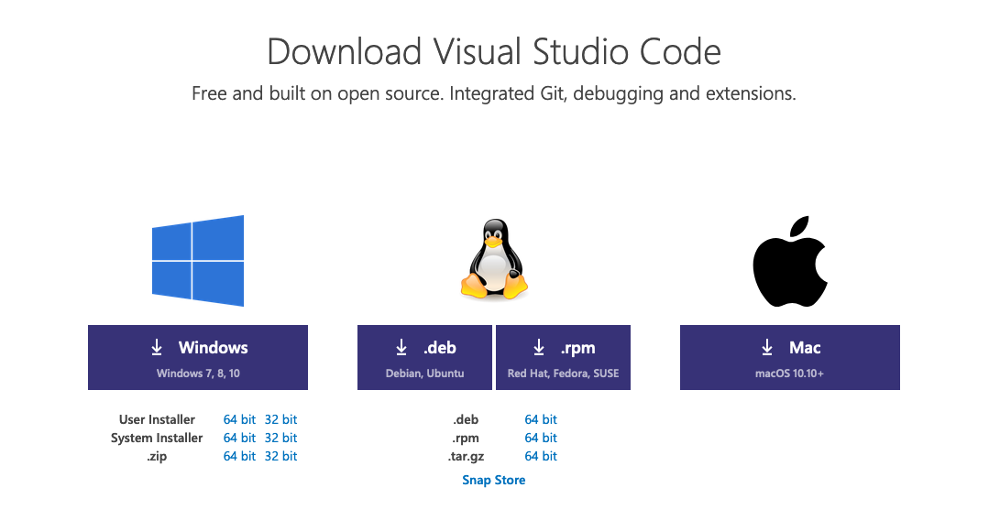
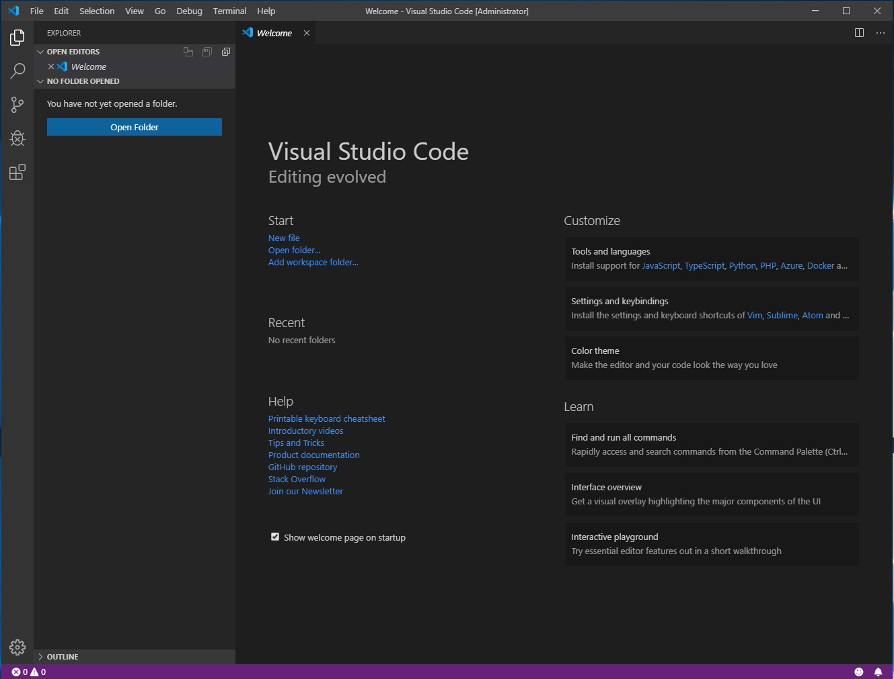
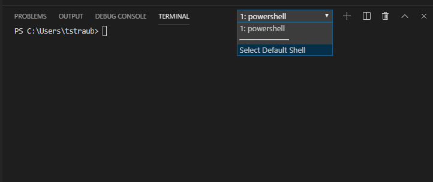
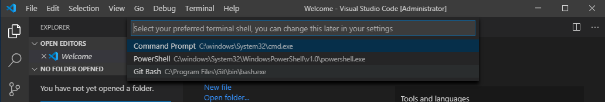
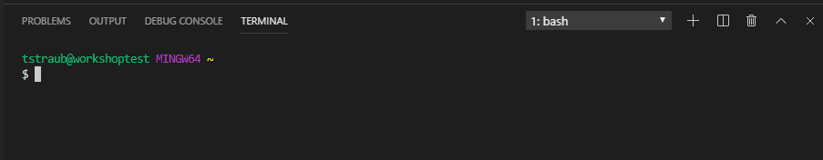

# Workstation Configuration

In this lab you will install all the tooling on your local machine.

> NOTE: If you are using windows, it is advised that you use the git-bash terminal to execute the workshop commands.

## How to (All)

Perform these steps regardless of platform.

### Download Visual Studio Code

You can Download the latest version here:

<https://code.visualstudio.com/Download>



> Be sure to check the box "Add to PATH" when installing, this will make launching vscode possible from the command line.

Open VSCode:



## How to (Windows)

### Install Chocolatey

Chocalatey is a package manager for Windows and will make installing the pre-requisites easier on Windows.

You can install Chocolatey simply by running the following command:

`Set-ExecutionPolicy Bypass -Scope Process -Force; iex ((New-Object System.Net.WebClient).DownloadString('https://chocolatey.org/install.ps1'))`

Further information is available here if needed:

<https://chocolatey.org/docs/installation>

Close your shell and reopen.

Ensure you can run the `choco` command:

```sh
$ choco
Chocolatey v0.10.15
Please run 'choco -?' or 'choco <command> -?' for help menu.
```

### Trouble with Chocolatey??

If you are having issues installing Chocolatey, follow each of these guides to install the requirements directly.

<details><summary>View Direct Downloads</summary>
<p>

- https://git-scm.com/download
- https://www.terraform.io/downloads.html
- https://cloud.google.com/sdk

</p>
</details>

### Download Git, gCloud, and Terraform

Run the following to install everything in order:

```sh
choco install -y git terraform
```

Now, downlaod and run the gCloud installer
```sh
https://cloud.google.com/sdk/docs/downloads-interactive#

```

> Note: If you are having issues with one of these installing, run them individually to identify which is causing the issue.

### Download Sentinel Simulator

Download can be found here:

<https://docs.hashicorp.com/sentinel/downloads.html>

Select the Windows -> 64-bit version.

This will download a zip file, extract it and copy to your `$HOME/bin` directory, this will ensure we can reach it easily from the command line.

> Note: Your `$HOME/bin` directory is typically "C:\Users\USERNAME\bin".

### Verify Installations

Verify you can run the following commands, with the appropriate results:

> **Note:** Versions may be greater than what is listed here.

**git**
```sh
$ git --version
git version 2.22.0.windows.1
```

**gCloud**
```sh
$ gcloud version
Google Cloud SDK 289.0.0
bq 2.0.56
core 2020.04.10
gsutil 4.49
```

**terraform**
```sh
$ terraform -v
Terraform v0.12.6
```

**sentinel**
```sh
$ sentinel -v
Sentinel Simulator v0.10.4
```

### Set VSCode to use git-bash

Open VSCode.

In the top menu select "View" -> "Terminal", this will open an integrated terminal.
This Terminal is where you will perform all of your tasks for the workshops.

> Alternatively you can use the keyboard shortcut "Ctrl + `"

Once the Integrated Terminal is open, click the dropdown to "Select Default Shell".



This will open the option to select your preferred terminal, select "Git Bash":



Remove your current terminal by clicking the trash can icon, then relaunch the Integrated Terminal.
You should now see something like this:




## How to (Mac)

### Upgrade `brew`

Run `brew update` to ensure you have access to packages.

### Download Git, gCloud, and Terraform

Run the following to install everything in order:

```sh
brew install git terraform
```

Now download and install gCloud
```sh
https://cloud.google.com/sdk/docs/quickstart-macos
```

> Note: If you are having issues with one of these installing, run them individually to identify which is causing the issue.

### Download Sentinel Simulator

Download can be found here:

<https://docs.hashicorp.com/sentinel/downloads.html>

Select the Mac OS X -> 64-bit version.

This will download a zip file, extract it and copy to your `/usr/local/bin/sentinel` directory, this will ensure we can reach it easily from the command line.

### Verify Installations

Verify you can run the following commands, with the appropriate results:

> **Note:** Versions may be greater than what is listed here.

**git**
```sh
$ git --version
git version 2.22.0 (Apple Git-117)
```

**gcloud sdx**
```sh
$ gcloud version
Google Cloud SDK 289.0.0
bq 2.0.56
core 2020.04.10
gsutil 4.49
```

**terraform**
```sh
$ terraform -v
Terraform v0.12.6
```

**sentinel**
```sh
$ sentinel -v
Sentinel Simulator v0.10.4
```

### Github Access

If you already have a github account you can skip this step.

Github repositories will be needed to complete some of the later workshops.

Sign up for a free github.com account by going to [https://github.com/join](https://github.com/join) and following the instructions.

Once created, login.


### Clone this repository

Open up a terminal and change directory into a path that you would like to work out of (I suggest creating a "~/TerraformWorkshop" folder).

> **Note:** The clone command is passing in a second argument to clone into the TerraformWorkshop folder directly.

Then open the repository in VS Code.

```sh
cd ~/TerraformWorkshop/101-
git clone https://github.com/gcp-terraform-workshop/terraform-workshop-labs-gcp.git .
code .
```

> If running `code .` doesn't launch VS Code, open up VS Code manually and open the folder you cloned the repository to.
