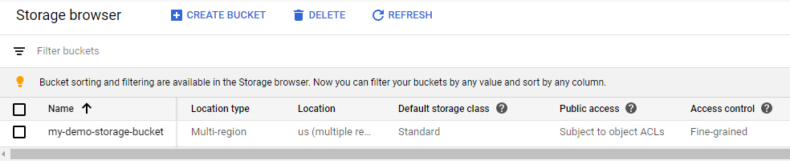

# Connecting To Google Cloud

## Expected Outcome

You will use Terraform to create simple infrastructure in your GCP Subscription.

In this challenge, you will:

- Initialize Terraform
- Run a `plan` on simple a simple resource
- Run an `apply` to create GCP infrastructure
- Run a `destroy` to remove GCP infrastructure

## How To

### Create Terraform Configuration

Change directory into a folder specific for this challenge.

For example: `cd ~/TerraformWorkshop/101-connect-gcp/`.

Create a file named `main.tf` and add the gcp provider and a resource block for a gcp storage bucket. 
The 'Project Id' value can be found by looking at the default project in your gcp account.

```hcl
provider "google" {
  region  = "us-east1"
  zone    = "us-east1-a"
  project = "<Your project id>"
}

resource "google_storage_bucket" "my_storage_bucket" {
  name          = "my-demo-storage-bucket"
  location      = "US"
}
```

### Authenticating To GCP

You will need to tell terraform how to authenticate to gcp by creating new service credentials.
### 1. Go to your gcp console and navigate to 'IAM & Admin' and select 'Service Accounts': 


### 2. Click `+ Create Service Account`

### 3. Enter **My Demo Project** in the Service Account name field and click `Create`. Select 'Project - Editor' role then click `Continue`

### 4. Click on Role, search for 'editor'. Select 'Editor - Access to All Resources', then click `Continue`


### 4. Click `+ Create Key`, then `Create', choose json format. This will create a key file and start a download. This file will be used to provice authentication credentials to your GCP terraform project.

### 5. Copy the new key file into the root folder of your terraform project.

### 6. Update the google provider terraform block with the new credential file name
```
provider "google" {
  credentials = file("YOUR CREDENTIALS FILE HERE")
  region  = "us-east1"
  zone    = "us-east1-a"
}
```

### Run the Terraform Workflow

`terraform init`
<details><summary>View Output</summary>
<p>

```sh
$ terraform init

Initializing the backend...

Initializing provider plugins...
- Checking for available provider plugins...
- Downloading plugin for provider "google" (hashicorp/google) 3.15.0...

The following providers do not have any version constraints in configuration,
so the latest version was installed.

To prevent automatic upgrades to new major versions that may contain breaking
changes, it is recommended to add version = "..." constraints to the
corresponding provider blocks in configuration, with the constraint strings
suggested below.

* provider.google: version = "~> 3.15"

Terraform has been successfully initialized!

You may now begin working with Terraform. Try running "terraform plan" to see
any changes that are required for your infrastructure. All Terraform commands
should now work.

If you ever set or change modules or backend configuration for Terraform,
rerun this command to reinitialize your working directory. If you forget, other
commands will detect it and remind you to do so if necessary.
```

</p>
</details>

---
`terraform plan`

<details><summary>View Output</summary>
<p>

```sh
$ terraform plan
Refreshing Terraform state in-memory prior to plan...
The refreshed state will be used to calculate this plan, but will not be
persisted to local or remote state storage.


------------------------------------------------------------------------

An execution plan has been generated and is shown below.
Resource actions are indicated with the following symbols:
  + create

Terraform will perform the following actions:

  # google_storage_bucket.my_storage_bucket will be created
  + resource "google_storage_bucket" "my_storage_bucket" {
      + bucket_policy_only = (known after apply)
      + force_destroy      = false
      + id                 = (known after apply)
      + location           = "US"
      + name               = "my-demo-storage-bucket"
      + project            = (known after apply)
      + self_link          = (known after apply)
      + storage_class      = "STANDARD"
      + url                = (known after apply)
    }

Plan: 1 to add, 0 to change, 0 to destroy.

------------------------------------------------------------------------

Note: You didn't specify an "-out" parameter to save this plan, so Terraform
can't guarantee that exactly these actions will be performed if
"terraform apply" is subsequently run.
```

</p>
</details>

---
`terraform apply`
<details><summary>View Output</summary>
<p>

```sh
$ terraform apply

An execution plan has been generated and is shown below.
Resource actions are indicated with the following symbols:
  + create

Terraform will perform the following actions:

  # google_storage_bucket.my_storage_bucket will be created
  + resource "google_storage_bucket" "my_storage_bucket" {
      + bucket_policy_only = (known after apply)
      + force_destroy      = false
      + id                 = (known after apply)
      + location           = "US"
      + name               = "my-demo-storage-bucket"
      + project            = (known after apply)
      + self_link          = (known after apply)
      + storage_class      = "STANDARD"
      + url                = (known after apply)
    }

Plan: 1 to add, 0 to change, 0 to destroy.

Do you want to perform these actions?
  Terraform will perform the actions described above.
  Only 'yes' will be accepted to approve.

  Enter a value: yes

google_storage_bucket.my_storage_bucket: Creating...
google_storage_bucket.my_storage_bucket: Creation complete after 1s [id=my-demo-storage-bucket]

Apply complete! Resources: 1 added, 0 changed, 0 destroyed.
```
</p>
</details>

---

Congrats, you just created your first GCP resource using Terraform!

### Verify in the GCP Console

Head over to the [GCP Console](https://console.cloud.google.com/)

View all Storage Buckets and you should see the recently created bucket.


### Scale Resources

Now add a new Storage Bucket resource that scales with a `count` parameter.

> Note: This is ADDING another `storage bucket` block in addition to the one you have already created.

```hcl
resource "google_storage_bucket" "count" {
  name     = "my-demo-storage-bucket-${count.index}"
  location = "US"
  count    = 2
}
```

Run another `terraform plan` then `terraform apply` and validate the buckets have been created.

---
## Advanced areas to explore

1. Play around with adjusting the `count` and `name` parameters, then running `plan` and `apply`.
2. Run the `plan` command with the `-out` option and apply that output.
3. Add tags to each resource.

---
### Cleanup

When you are done, destroy the infrastructure, you no longer need it.

The output will look ***similar*** to this:

```sh
$  terraform destroy
google_storage_bucket.count[1]: Refreshing state... [id=my-demo-storage-bucket-1]
google_storage_bucket.count[0]: Refreshing state... [id=my-demo-storage-bucket-0]
google_storage_bucket.my_storage_bucket: Refreshing state... [id=my-demo-storage-bucket]

An execution plan has been generated and is shown below.
Resource actions are indicated with the following symbols:
  - destroy

Terraform will perform the following actions:

  # google_storage_bucket.count[0] will be destroyed
  - resource "google_storage_bucket" "count" {
      - bucket_policy_only       = false -> null
      - default_event_based_hold = false -> null
      - force_destroy            = false -> null
      - id                       = "my-demo-storage-bucket-0" -> null
      - labels                   = {} -> null
      - location                 = "US" -> null
      - name                     = "my-demo-storage-bucket-0" -> null
      - project                  = "dazzling-mantra-271319" -> null
      - requester_pays           = false -> null
      - self_link                = "https://www.googleapis.com/storage/v1/b/my-demo-storage-bucket-0" -> null
      - storage_class            = "STANDARD" -> null
      - url                      = "gs://my-demo-storage-bucket-0" -> null
    }

  # google_storage_bucket.count[1] will be destroyed
  - resource "google_storage_bucket" "count" {
      - bucket_policy_only       = false -> null
      - default_event_based_hold = false -> null
      - force_destroy            = false -> null
      - id                       = "my-demo-storage-bucket-1" -> null
      - labels                   = {} -> null
      - location                 = "US" -> null
      - name                     = "my-demo-storage-bucket-1" -> null
      - project                  = "dazzling-mantra-271319" -> null
      - requester_pays           = false -> null
      - self_link                = "https://www.googleapis.com/storage/v1/b/my-demo-storage-bucket-1" -> null
      - storage_class            = "STANDARD" -> null
      - url                      = "gs://my-demo-storage-bucket-1" -> null
    }

  # google_storage_bucket.my_storage_bucket will be destroyed
  - resource "google_storage_bucket" "my_storage_bucket" {
      - bucket_policy_only       = false -> null
      - default_event_based_hold = false -> null
      - force_destroy            = false -> null
      - id                       = "my-demo-storage-bucket" -> null
      - labels                   = {} -> null
      - location                 = "US" -> null
      - name                     = "my-demo-storage-bucket" -> null
      - project                  = "dazzling-mantra-271319" -> null
      - requester_pays           = false -> null
      - self_link                = "https://www.googleapis.com/storage/v1/b/my-demo-storage-bucket" -> null
      - storage_class            = "STANDARD" -> null
      - url                      = "gs://my-demo-storage-bucket" -> null
    }

Plan: 0 to add, 0 to change, 3 to destroy.

Do you really want to destroy all resources?
  Terraform will destroy all your managed infrastructure, as shown above.
  There is no undo. Only 'yes' will be accepted to confirm.

  Enter a value: yes

google_storage_bucket.count[1]: Destroying... [id=my-demo-storage-bucket-1]
google_storage_bucket.my_storage_bucket: Destroying... [id=my-demo-storage-bucket]
google_storage_bucket.count[0]: Destroying... [id=my-demo-storage-bucket-0]
google_storage_bucket.my_storage_bucket: Destruction complete after 1s
google_storage_bucket.count[0]: Destruction complete after 1s
google_storage_bucket.count[1]: Destruction complete after 1s

Destroy complete! Resources: 3 destroyed.

## Resources

- [Terraform Count](https://www.terraform.io/docs/configuration/interpolation.html#count-information)
