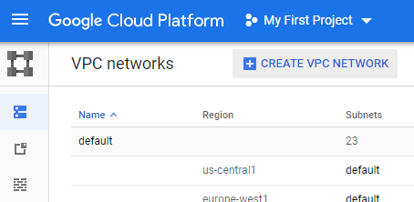
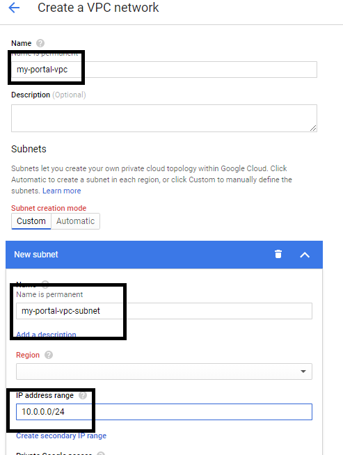
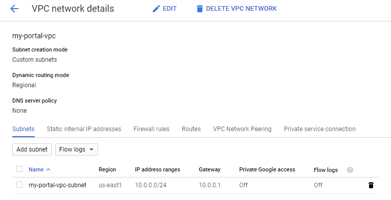

# Connecting To GCP

## Expected Outcome

You will use Terraform to create simple infrastructure in GCP.

In this challenge, you will:

- Initialize Terraform
- Run a `plan` on simple a simple resource
- Run an `apply` to create GCP infrastructure
- Run a `destroy` to remove GCP infrastructure

## How To

### Create Terraform Configuration

Change directory into a folder specific to this challenge.

Create an empty file named `main.tf`.

---

## How To

> NOTE: It is critical that you chose a unique PREFIX if you are in a shared GCP Account. Below if you see "myportal-vpc", add a prefix to make the name unique (Example: "jsmith-myportal-vpc).

### Create Infrastructure in GCP

Navigate to the GCP Console and click on the "VPC Networks" item on the left side and then click  "+ Create VPC Network":



In the VPC Create dialog, give the VPC the name "myportal-vpc", select any region,
  give the subnet the name "my-portal-vpc-subnet",
   a subnet Ip range of "10.0.0.0/24" and click "Create":



Once the VPC is created, navigate to it.

At this point we have a VPC setup in GCP and are ready to import this into Terraform.



### Create Terraform Configuration

Copy the `provider "google"` block from you main.tf in 101-connect-gcp. This will setup the correct connection to yoru gcp account
We will now add a `resource` blocks to represent the infrastructure we are about to import.

We have two resources we need to import into our Terraform Configuration, to do this we need to do two things:

1. Create the base Terraform configuration for both resources.
2. Run `terraform import` to bring the infrastructure into our state file.

To create the base configuration place the following code into the `main.tf` file.
It's important to remember than terrafrom import only imports the state of a resource to your state file. 
It does not create the config. You have to do that yourself.

```hcl
resource "google_compute_network" "vpc_network" {
  name                            = "my-portal-vpc"
  auto_create_subnetworks         = false
  delete_default_routes_on_create = false

  timeouts {}
}

resource "google_compute_subnetwork" "network-with-private-secondary-ip-ranges" {
  name          = "my-portal-vpc-subnet"
  ip_cidr_range = "10.0.0.0/24"
  network       = google_compute_network.vpc_network.my-portal-vpc
}
```

`terraform plan`

Shows 2 to add

```sh
Terraform will perform the following actions:

  # google_compute_network.vpc_network will be created
  + resource "google_compute_network" "vpc_network" {
      + auto_create_subnetworks         = false
      + delete_default_routes_on_create = false
      + gateway_ipv4                    = (known after apply)
      + id                              = (known after apply)
      + ipv4_range                      = (known after apply)
      + name                            = "my-portal-vpc"
      + project                         = (known after apply)
      + routing_mode                    = (known after apply)
      + self_link                       = (known after apply)

      + timeouts {}
    }

  # google_compute_subnetwork.vpc_subnet will be created
  + resource "google_compute_subnetwork" "vpc_subnet" {
      + creation_timestamp = (known after apply)
      + enable_flow_logs   = (known after apply)
      + fingerprint        = (known after apply)
      + gateway_address    = (known after apply)
      + id                 = (known after apply)
      + ip_cidr_range      = "10.0.0.0/24"
      + name               = "my-portal-vpc-subnet"
      + network            = (known after apply)
      + project            = (known after apply)
      + region             = (known after apply)
      + secondary_ip_range = (known after apply)
      + self_link          = (known after apply)
    }

Plan: 2 to add, 0 to change, 0 to destroy.
```

> CAUTION: This is not what we want!

### Import the VPC

We need two values to run the `terraform import` command:

1. Resource Address from our configuration
1. GCP resource name

The Resource Address is simple enough, based on the configuration above it is simply "google_compute_network.vpc_network".

The resource id is the resource name you gave the VPC when you created it. my-portal_vpc

Now run the import command:

```sh
$ terraform import google_compute_network.vpc_network my-portal-vpc

Import successful!

The resources that were imported are shown above. These resources are now in
your Terraform state and will henceforth be managed by Terraform.
```

### Import the VPC Subnet

The process here is the same.

The Resource Address is simple enough, based on the configuration above it is simply "google_compute_subnetwork.vpc_subnet".

The resource ID is the resource name you gave the VPC subnet when you created it. my-portal_vpc-subnet.

```sh
$ terraform import google_compute_subnetwork.vpc_subnet my-portal-vpc-subnet

Import successful!

The resources that were imported are shown above. These resources are now in
your Terraform state and will henceforth be managed by Terraform.
```

### Verify Plan

Run a `terraform plan`, you should see no changes:

```sh
$ terraform plan

...

No changes. Infrastructure is up-to-date.

This means that Terraform did not detect any differences between your
configuration and real physical resources that exist. As a result, no
actions need to be performed.
```

### Make a Change

Add the following tag configuration to the Subnet:

```hcl

resource "google_compute_subnetwork" "vpc_subnet" {
  ...
  ip_cidr_range = "10.0.0.0/16"
}
```

Run a plan, we should see two changes.

```sh
  # google_compute_subnetwork.vpc_subnet will be updated in-place
  ~ resource "google_compute_subnetwork" "vpc_subnet" {
        creation_timestamp       = "2020-04-15T10:11:55.486-07:00"
        gateway_address          = "10.0.0.1"
        id                       = "projects/dazzling-mantra-271319/regions/us-east1/subnetworks/my-portal-vpc-subnet"
      ~ ip_cidr_range            = "10.0.0.0/24" -> "10.0.0.0/16"
        name                     = "my-portal-vpc-subnet"
        network                  = "https://www.googleapis.com/compute/v1/projects/dazzling-mantra-271319/global/networks/my-portal-vpc"
        private_ip_google_access = false
        project                  = "dazzling-mantra-271319"
        region                   = "us-east1"
        secondary_ip_range       = []
        self_link                = "https://www.googleapis.com/compute/v1/projects/dazzling-mantra-271319/regions/us-east1/subnetworks/my-portal-vpc-subnet"

        timeouts {}
    }

Plan: 0 to add, 1 to change, 0 to destroy.
```

Run `terraform apply`.

```sh
Apply complete! Resources: 0 added, 1 changed, 0 destroyed.
```

SUCCESS! You have now brought existing infrastructure into Terraform.

### Cleanup

When you are done, destroy the infrastructure, you no longer need it.

```sh
$ terraform destroy
google_compute_network.vpc_network: Refreshing state... [id=projects/dazzling-mantra-271319/global/networks/my-portal-vpc]
google_compute_subnetwork.vpc_subnet: Refreshing state... [id=projects/dazzling-mantra-271319/regions/us-east1/subnetworks/my-portal-vpc-subnet]

An execution plan has been generated and is shown below.
Resource actions are indicated with the following symbols:
  - destroy

Terraform will perform the following actions:

  # google_compute_network.vpc_network will be destroyed
  - resource "google_compute_network" "vpc_network" {
      - auto_create_subnetworks         = false -> null
      - delete_default_routes_on_create = false -> null
      - id                              = "projects/dazzling-mantra-271319/global/networks/my-portal-vpc" -> null
      - name                            = "my-portal-vpc" -> null
      - project                         = "dazzling-mantra-271319" -> null
      - routing_mode                    = "REGIONAL" -> null
      - self_link                       = "https://www.googleapis.com/compute/v1/projects/dazzling-mantra-271319/global/networks/my-portal-vpc" -> null

      - timeouts {}
    }

  # google_compute_subnetwork.vpc_subnet will be destroyed
  - resource "google_compute_subnetwork" "vpc_subnet" {
      - creation_timestamp       = "2020-04-15T10:11:55.486-07:00" -> null
      - gateway_address          = "10.0.0.1" -> null
      - id                       = "projects/dazzling-mantra-271319/regions/us-east1/subnetworks/my-portal-vpc-subnet" -> null
      - ip_cidr_range            = "10.0.0.0/16" -> null
      - name                     = "my-portal-vpc-subnet" -> null
      - network                  = "https://www.googleapis.com/compute/v1/projects/dazzling-mantra-271319/global/networks/my-portal-vpc" -> null
      - private_ip_google_access = false -> null
      - project                  = "dazzling-mantra-271319" -> null
      - region                   = "us-east1" -> null
      - secondary_ip_range       = [] -> null
      - self_link                = "https://www.googleapis.com/compute/v1/projects/dazzling-mantra-271319/regions/us-east1/subnetworks/my-portal-vpc-subnet" -> null

      - timeouts {}
    }

Plan: 0 to add, 0 to change, 2 to destroy.

Do you really want to destroy all resources?
  Terraform will destroy all your managed infrastructure, as shown above.
  There is no undo. Only 'yes' will be accepted to confirm.

  Enter a value: yes

google_compute_subnetwork.vpc_subnet: Destroying... [id=projects/dazzling-mantra-271319/regions/us-east1/subnetworks/my-portal-vpc-subnet]
google_compute_subnetwork.vpc_subnet: Destruction complete after 22s
google_compute_network.vpc_network: Destroying... [id=projects/dazzling-mantra-271319/global/networks/my-portal-vpc]
google_compute_network.vpc_network: Destruction complete after 21s

Destroy complete! Resources: 2 destroyed.
```

Because the infrastructure is now managed by Terraform, we can destroy just like before.

Run a `terraform destroy` and follow the prompts to remove the infrastructure.

## Advanced areas to explore

1. Play around with adjusting the `count` and `name` parameters, then running `plan` and `apply`.
2. Run the `plan` command with the `-out` option and apply that output.
3. Add tags to each resource.

## Resources

- [Terraform Count](https://www.terraform.io/docs/configuration/interpolation.html#count-information)
- [Terraform Import](https://www.terraform.io/docs/commands/import.html)
