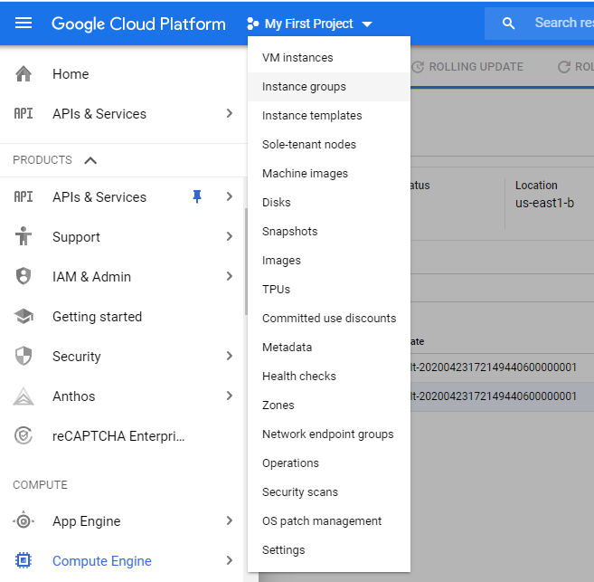
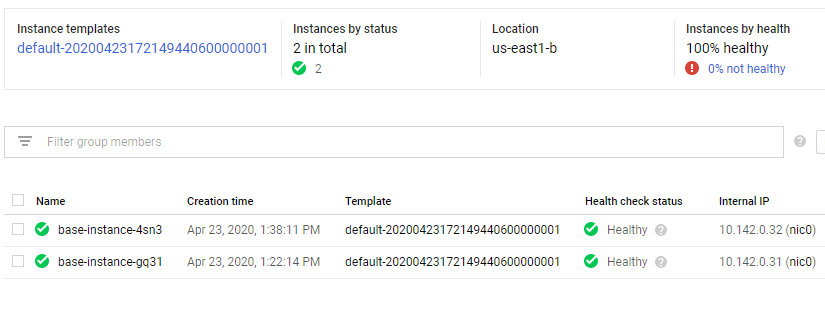

In this lab you will implement a common cloud pattern with Terraform. To demonstate how terraform can make setting up multiple instances a simpler task using patterns let's start first with the pattern you will need to create for the managed instance group. This is a collection of identical VMs that you define via an instance template and set scale on.

## Resources created 
- *google_compute_instance_template*: The instance template assigned to the instance group.
- *google_compute_instance_group_manager*: The instange group manager that uses the instance template and target pools.
- *google_compute_health_check*: Monitors the status of each instance VM
- *google_compute_firewall*: Firewall rule to allow ssh access to the instances.

## How to

### Create the base Terraform Configuration

Change directory into a folder specific to this challenge.

For example: `cd ~/TerraformWorkshop/103-basic-tf-configurations/`.

We will start with a few of the basic files needed.

Create a `main.tf` file to hold our configuration.
Create a `variables.tf` file to hold some variables to make our code cleaner.
Create a `terraform.tfvars` file to hold our variable values.

### Add base provider and terrafor config blocks

In `main.tf` add the same provider and terraform blocks from 101-connect-gcp.

```hcl
terraform {
  backend "gcs" {
    ...snip...  
  }
}

provider "google" {
    ...snip...  
}
```

### Create Variables

In variables.tf define the following variables that will help keep our code clean:

```hcl
variable "project_id" {
    description = "The GCP project id where the resources will be created"
    type = string
}

variable "region" {
    default = "us-east1"
    description = "GCP region the resources will be created in"
    type = string
}

variable "svc_acct_email" {
    default = ""
    description = "email account for VM service account"
    type = string
}
```

### Settings the Variable Values

In terraform.tfvars set values for the variables you defined in variables.tf
```hcl
region = "us-east1"
project_id = "[set this to the project id from 101-connect-gcp]"
svc_acct_email = "[set this to the project email address from 101-connect-gcp]"

```

### Create Terraform config

With your variables setup, you can now begin to create the terraform configuration, you will do this in main.tf

### Add compute instance template.

In previous labs, you have created a single virtual machine. Now, you are going to define a template from which many identical virtual machines can be created.

Add the following block to your main.tf file. also, copy the `vm_startup.txt` file from 201-common-providers-gcp lab into the same folder. 

```hcl
resource "google_compute_instance_template" "default" {  
  project     = var.project_id
  name_prefix = "default-"

  machine_type = "f1-micro"

  region = "us-east1"

  tags = ["allow-service"]

  labels = {}

  network_interface {
    network            = "default"
    subnetwork         = "default"
    access_config {// Ephemeral IP
    }
  }

  can_ip_forward = false

  disk {
    auto_delete  = true
    boot         = true
    source_image = "ntu-1804-lts"
    type         = "PERSISTENT"
    disk_type    = "pd-ssd"
    mode         = "READ_WRITE"
  }

  service_account {
    email = var.svc_acct_email 
    scopes = ["userinfo-email", "compute-ro", "storage-ro"]
  }

  metadata_startup_script = file("vm_startup.txt")

  scheduling {
    preemptible       = false
    automatic_restart = true
  }

  lifecycle {
    create_before_destroy = true
  }
}
```

Go ahead and run `terraform plan` and check that everything is entered correctly. Your output should look similar to this

```hcl
Refreshing Terraform state in-memory prior to plan...
The refreshed state will be used to calculate this plan, but will not be
persisted to local or remote state storage.


------------------------------------------------------------------------

An execution plan has been generated and is shown below.
Resource actions are indicated with the following symbols:
  + create

Terraform will perform the following actions:

  # google_compute_instance_template.default will be created
  + resource "google_compute_instance_template" "default" {
      + can_ip_forward          = false
      + id                      = (known after apply)
      + machine_type            = "f1-micro"
      + metadata_fingerprint    = (known after apply)
      + metadata_startup_script = <<~EOT
            #!/bin/bash

            # Setup logging
            logfile="/tmp/custom-data.log"
            exec > $logfile 2>&1

            python3 -V
            sudo apt update
            sudo apt install -y python3-pip python3-flask
            python3 -m flask --version

            sudo cat << EOF > /tmp/hello.py
            from flask import Flask
            import requests

            app = Flask(__name__)

            import requests
            @app.route('/')
            def hello_world():
                return """<!DOCTYPE html>
            <html>
            <head>
                <title>Kittens</title>
            </head>
            <body>
                
            </body>
            </html>"""
            EOF

            chmod +x /tmp/hello.py

            sudo -b FLASK_APP=/tmp/hello.py flask run --host=0.0.0.0 --port=8000
        EOT
      + name                    = (known after apply)
      + name_prefix             = "default-"
      + project                 = "dazzling-mantra-271319"
      + region                  = "us-east1"
      + self_link               = (known after apply)
      + tags                    = [
          + "allow-service",
        ]
      + tags_fingerprint        = (known after apply)

      + disk {
          + auto_delete  = true
          + boot         = true
          + device_name  = (known after apply)
          + disk_type    = "pd-ssd"
          + interface    = (known after apply)
          + mode         = "READ_WRITE"
          + source_image = "ntu-1804-lts"
          + type         = "PERSISTENT"
        }

      + network_interface {
          + name               = (known after apply)
          + network            = "default"
          + subnetwork         = "default"
          + subnetwork_project = (known after apply)

          + access_config {
              + nat_ip                 = (known after apply)
              + network_tier           = (known after apply)
              + public_ptr_domain_name = (known after apply)
            }
        }

      + scheduling {
          + automatic_restart   = true
          + on_host_maintenance = (known after apply)
          + preemptible         = false
        }

      + service_account {
          + email  = "dazzling-mantra-271319@appspot.gserviceaccount.com"
          + scopes = [
              + "https://www.googleapis.com/auth/compute.readonly",
              + "https://www.googleapis.com/auth/devstorage.read_only",
              + "https://www.googleapis.com/auth/userinfo.email",
            ]
        }
    }

Plan: 1 to add, 0 to change, 0 to destroy.

------------------------------------------------------------------------

Note: You didn't specify an "-out" parameter to save this plan, so Terraform
can't guarantee that exactly these actions will be performed if
"terraform apply" is subsequently run.
```

The next resource you need to create is the managed instance group manager. This resource defines the setup and on configuration of your group of virtual machines. You will also create a basic health check resource to check on the operational status of each VM instance.

Once again, please put this code into your `main.tf file`.

```hcl

resource "google_compute_instance_group_manager" "default" {
  project            = var.project_id
  name               = "my_default_Instance_Group"
  description        = "compute VM Instance Group"
  wait_for_instances = false

  base_instance_name = "default-"

  version {
    instance_template = google_compute_instance_template.default.self_link
  }
  
  zone = "us-east1-a"

  target_size = 2

  named_port {
    name = "http"
    port = 80
  }

  auto_healing_policies {
    health_check      = google_compute_health_check.mig-health-check.self_link
    initial_delay_sec = 30
  }
}

```
Finally, you need to create a google_compute_health_check and a google_compute_firewall.
The health check is a monitoring resource the will regularly check an http address on each vm to see if it gets a response. In a production system, you would set automated reactions to failures on the health checks based on your business needs.
The firewall is similar to other firewalls you've already created in previous labs.

In your `main.tf`, add the following blocks

```hcl
resource "google_compute_health_check" "mig-health-check" {
  name    = "my-instance-group-hc"
  project = var.project_id

  check_interval_sec  = 30
  timeout_sec         = 10
  healthy_threshold   = 1
  unhealthy_threshold = 10

  http_health_check {
    port         = 8000
    request_path = "/"
  }
}

resource "google_compute_firewall" "default" {
  name       = "default-firewall"
  network    = "default"

  allow {
    protocol = "icmp"
  }

  allow {
    protocol = "tcp"
    ports    = ["80", "8000", "8080"]
  }


  source_ranges = ["0.0.0.0/0"]
}

```

### Run Terraform Workflow

Run `terraform init` since this is the first time we are running Terraform from this directory.

Run `terraform plan` where you should see the plan of all the new resources.

Run `terraform apply` to create all the infrastructure.

It takes a while for the instance group to fully spin up and the startup script to execute.

Open a browser and navigate to your good console. Once logged in, head over to the Computer Engine | Instance Groups section.


Once there clikc on your new instance group to view the details. The instances will initially show a status of being 'verified'. You need to wait until this is complete and the console shows this:


Now, you can copy either external ip address and in a new browser window navigate to the following site to see some cute kittens!

`http://<external ip>:8000`

### Clean up

When you are done, run `terraform destroy` to remove everything we created.

## Advanced areas to explore

1. Change the instance count on `google_compute_instance_group_manager` 
2. Change other parameters to see how the instances change [Google Compute Instance Manager](https://www.terraform.io/docs/providers/google/r/compute_instance_group_manager.html) data resource.

